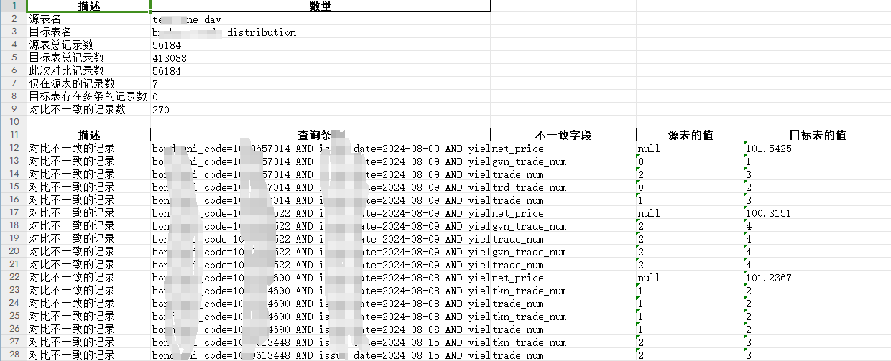

# 对比工具集

## 一. 项目介绍

做一个快速的对比工具集

### 目前实现功能
1. 数据库对比
    - mysql
    - pgsql

# 二. 数据库对比
### 1. 安装
```shell
pip install diff-kit
```
### 2. 使用
```python
from diff_kit.db_diff.core import DbDiffRunner
"""
参数说明：
report_name: str 报告名称
db_type: str 数据库类型，目前支持[mysql, pgsql]
db_conn_a: dict 数据库连接信息 {"host": "127.0.0.1", "port": 3306, "user": "root", "password": "123456"}
db_conn_b: dict 数据库连接信息 {"host": "127.0.0.1", "port": 3306, "user": "root", "password": "123456"}
db_name_a: str，数据库A的名称。
table_name_a: str，表A的名称。
table_name_b: str，表B的名称。
db_name_b: str = None，数据库B的名称，默认为None。
query_condition_a: str = None，查询条件A，为字符串格式，默认为None。
query_condition_b: dict = None，查询条件B，为字典格式，默认为None。
diff_columns: list = None，需要进行差异比较的列名列表，默认为None。
exclude_columns: list = None，需要排除在比较之外的列名列表，默认为None。
mapping: dict = None，列名映射字典，用于指定表A的列名如何映射到表B的列名，默认为None。
compare_count: bool 是否只对比行数
only_generate_failed_report: 是否仅失败时生成报告,
report_type: str = 'excel', 报告类型，默认excel 可选['excel', 'text]
"""
params = {
    "report_name": "demo",
    "db_type": "mysql",
    "db_conn_a": {"host": "127.0.0.1", "port": 3306, "user": "root", "password": "123456"},
    "db_conn_b": {"host": "127.0.0.1", "port": 3306, "user": "root", "password": "123456"},
    "db_name_a": "test",
    "table_name_a": "test_table1",
    "table_name_b": "test_table2",
    "query_condition_b": ["id"],
}
DbDiffRunner(**params).diff()
```

### 3. 查看报告
报告在output目录下
